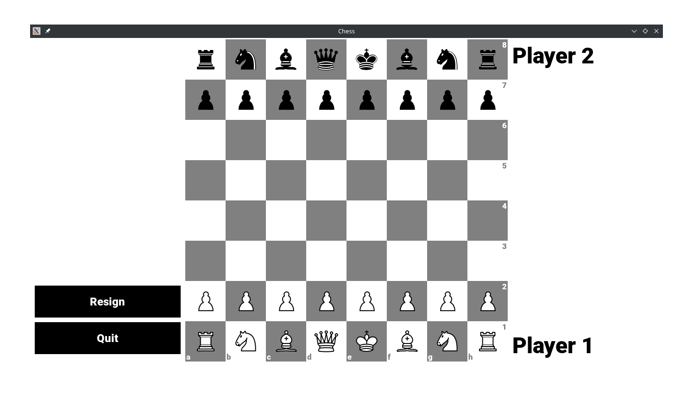

# Chess

This was done as a project for 3rd sem Object Oriented Programming. We built a functional chess game with multiplayer and singleplayer(using [Stockfish]())

## Installation

-   Install [SDL](https://wiki.libsdl.org/SDL2/Installation), [SDL_ttf](https://github.com/libsdl-org/SDL_ttf/releases), [SDL_mixer](https://github.com/libsdl-org/SDL_mixer/releases) and [SDL_image](https://github.com/libsdl-org/SDL_image/releases)
-   For windows, run `run.bat`
-   For linux, build and run using cmake

```bash
cmake -S . -B build
cmake --build build
./build/Chess
```

## Screenshots

| Menu                               | Starting Position                  | Random Position                      |
| ---------------------------------- | ---------------------------------- | ------------------------------------ |
|       |   |      |
| Check                              | Checkmate                          | Resignation                          |
|      |  |  |
| Promotion                          | Against Stockfish                  | Castling                             |
|  |  |       |

## Team members

1. Aashirbad Bhandari(@aashirbadb)
2. Alish Thapa(@Alishdaii)
3. Arpit Pokhrel(@ArpitPokhrel)
4. Bhumi Raj Sharma(@bhuwan856)
